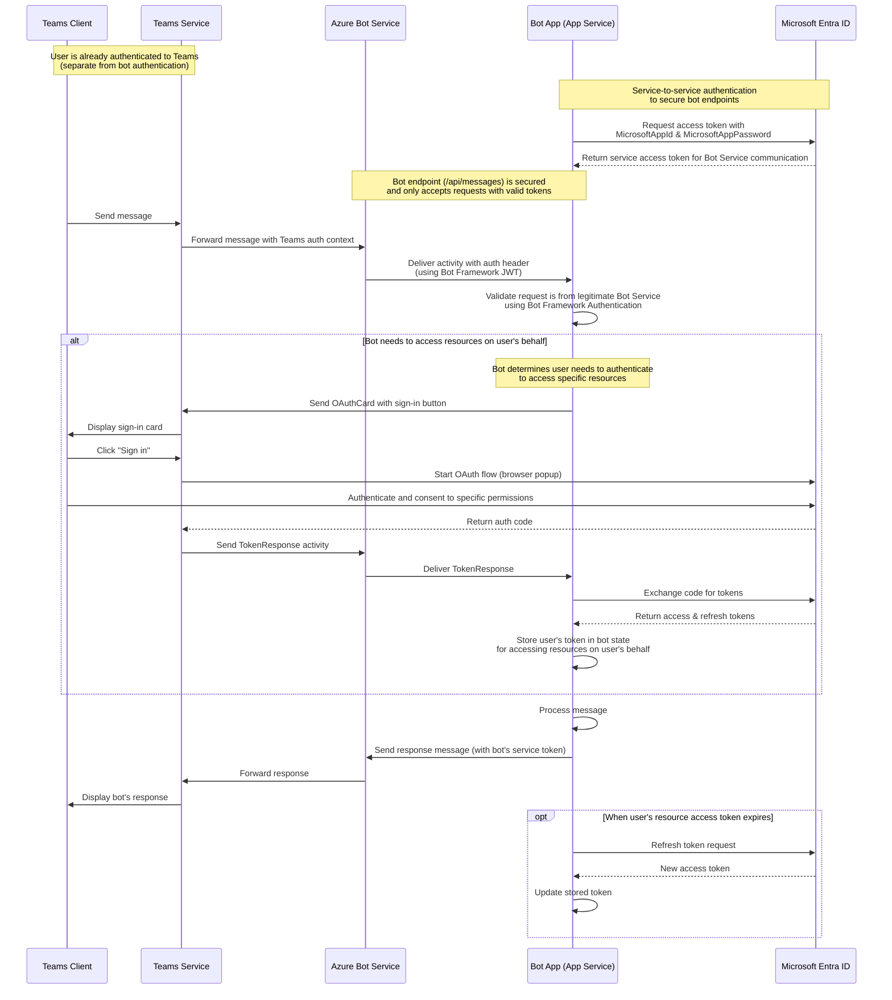

# Sequence Diagram

This sequence diagram represents a typical user scenario of using the app with the specified entities, including authentication flows.

## Authentication Notes

- **Teams Authentication**: The user authenticates to Teams independently before any bot interaction occurs
- **Bot Service Authentication**: The bot endpoint is secured using the app registration (MicrosoftAppId & MicrosoftAppPassword)
- **User Resource Authentication**: Optional flow that only happens when the bot needs to access resources on behalf of the user

## Endpoints

- Teams Client: N/A
- Teams Service: N/A
- Azure Bot Service: N/A
- Bot App (App Service): `https://<your-app-service-name>.azurewebsites.net/api/messages` (secured endpoint)
- Microsoft Entra ID: `https://login.microsoftonline.com/<tenant-id>`
