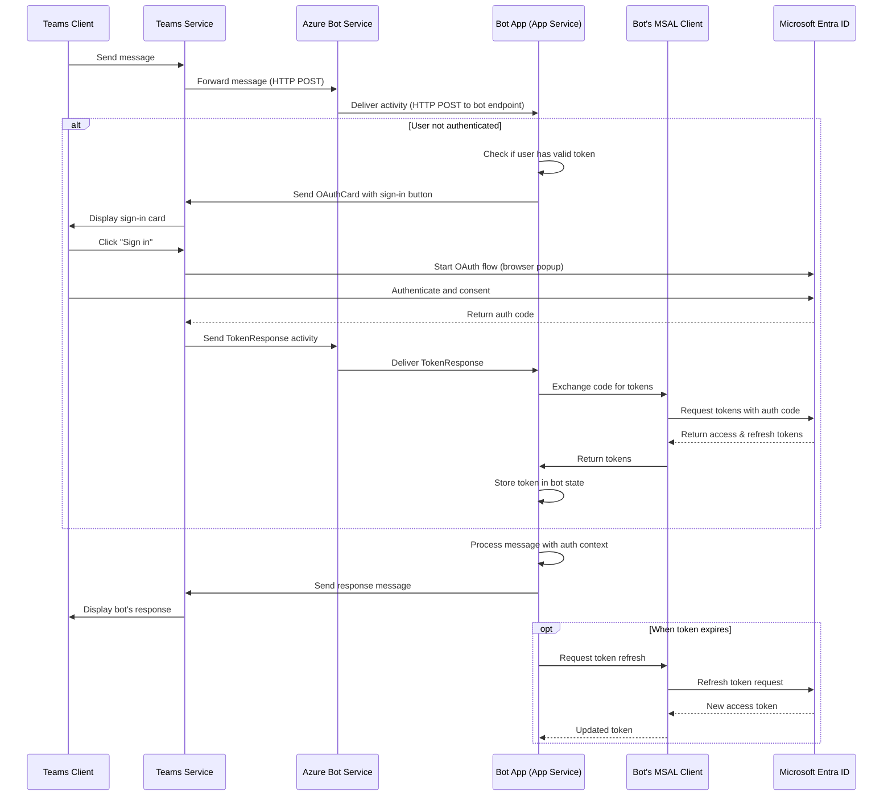

# Sequence Diagram

This sequence diagram represents a typical user scenario of using the app with the specified entities, including authentication flow.

## Endpoints

- Teams Client: N/A
- Teams Service: N/A
- Azure Bot Service: N/A
- Bot App (App Service): `https://<your-app-service-name>.azurewebsites.net/api/messages`
- Microsoft Entra ID: `https://login.microsoftonline.com/<tenant-id>`
