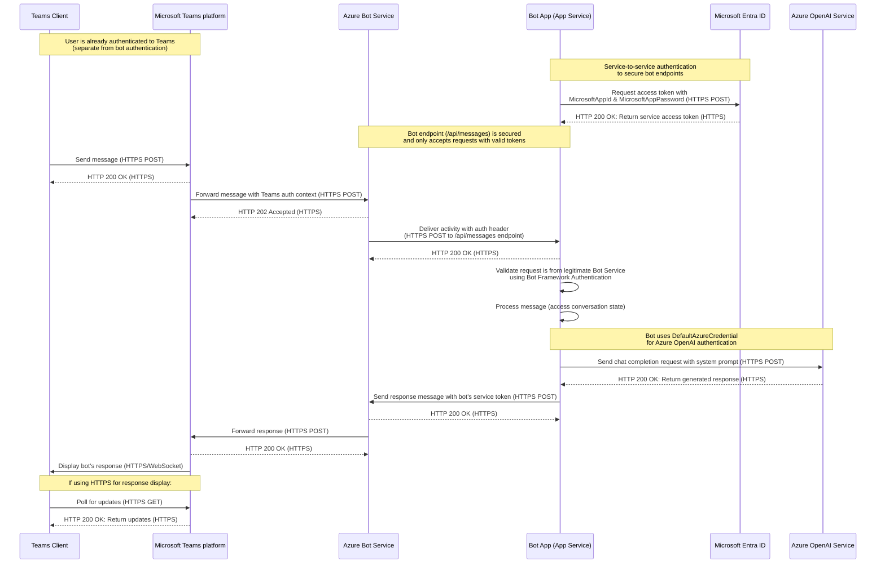

# Sequence Diagram

This sequence diagram represents a typical user scenario of using the app with the specified entities.

## Participants

| Participant              | Description                                                                                                              | Documentation                                                                                               |
| ------------------------ | ------------------------------------------------------------------------------------------------------------------------ | ----------------------------------------------------------------------------------------------------------- |
| Teams Client             | The Microsoft Teams client application used by end users to interact with the bot.                                       | [Microsoft Teams client overview](https://learn.microsoft.com/en-us/microsoftteams/get-clients)             |
| Microsoft Teams platform | The backend platform that powers Microsoft Teams, handling message routing and delivery between clients and services.    | [Microsoft Teams platform overview](https://learn.microsoft.com/en-us/microsoftteams/platform/overview)     |
| Azure Bot Service        | Microsoft's managed service for bot deployment and connectivity to messaging channels including Teams.                   | [Azure Bot Service documentation](https://learn.microsoft.com/en-us/azure/bot-service/bot-service-overview) |
| Bot App (App Service)    | The custom bot application deployed to Azure App Service hosting the bot's logic and handling chat interactions.         | [Azure App Service documentation](https://learn.microsoft.com/en-us/azure/app-service/overview)             |
| Microsoft Entra ID       | Microsoft's cloud identity service, formerly known as Azure Active Directory, used for authentication and authorization. | [Microsoft Entra ID documentation](https://learn.microsoft.com/en-us/entra/identity/fundamentals/whatis-id) |
| Azure OpenAI Service     | Microsoft's cloud-based service providing API access to OpenAI's GPT models, used for generating responses.              | [Azure OpenAI Service documentation](https://learn.microsoft.com/en-us/azure/ai-services/openai/overview)   |

## Communication Protocols

- **HTTPS**: Used for all secure API communication between services
- **WebSocket**: Used for real-time communication between Teams client and service for message delivery
- **JWT (JSON Web Tokens)**: Used for authentication between services (carried over HTTPS)

## Authentication Notes

- **Teams Authentication**: The user authenticates to Teams independently before any bot interaction occurs
- **Bot Service Authentication**: The bot endpoint is secured using the app registration (MicrosoftAppId & MicrosoftAppPassword)
- **No User Resource Authentication**: This bot implementation does not include functionality for the bot to access resources on behalf of the user (no OAuthCard, token exchange, etc.)
- **Azure OpenAI Authentication**: The bot uses DefaultAzureCredential (managed identity) to authenticate with Azure OpenAI Service

## Endpoints

- Teams Client: N/A
- Microsoft Teams platform: N/A
- Azure Bot Service: N/A
- Bot App (App Service): `https://<your-app-service-name>.azurewebsites.net/api/messages` (secured endpoint)
- Microsoft Entra ID: `https://login.microsoftonline.com/<tenant-id>`
- Azure OpenAI Service: `https://<your-openai-resource-name>.openai.azure.com/`
