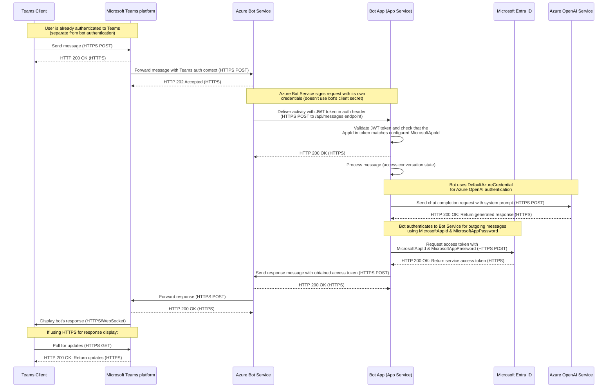

# Sequence Diagram

This sequence diagram represents a typical user scenario of using the app with the specified entities.

## Participants

| Participant                                                                                    | Description                                                                                                              | Pricing                                                                                                                              |
| ---------------------------------------------------------------------------------------------- | ------------------------------------------------------------------------------------------------------------------------ | ------------------------------------------------------------------------------------------------------------------------------------ |
| [Teams Client](https://learn.microsoft.com/en-us/microsoftteams/get-clients)                   | The Microsoft Teams client application used by end users to interact with the bot.                                       | [Free to download and use on all platforms](https://www.microsoft.com/en-us/microsoft-teams/download-app)                            |
| [Microsoft Teams platform](https://learn.microsoft.com/en-us/microsoftteams/platform/overview) | The backend platform that powers Microsoft Teams, handling message routing and delivery between clients and services.    | [Free tier available with premium options](https://www.microsoft.com/ja-jp/microsoft-teams/compare-microsoft-teams-options)          |
| [Azure Bot Service](https://learn.microsoft.com/en-us/azure/bot-service/bot-service-overview)  | Microsoft's managed service for bot deployment and connectivity to messaging channels including Teams.                   | [Free for standard channels with premium options](https://azure.microsoft.com/en-us/pricing/details/bot-services/)                   |
| [Bot App (App Service)](https://learn.microsoft.com/en-us/azure/app-service/overview)          | The custom bot application deployed to Azure App Service hosting the bot's logic and handling chat interactions.         | [Free and paid tiers available](https://azure.microsoft.com/en-us/pricing/details/app-service/windows/)                              |
| [Microsoft Entra ID](https://learn.microsoft.com/en-us/entra/identity/fundamentals/whatis-id)  | Microsoft's cloud identity service, formerly known as Azure Active Directory, used for authentication and authorization. | [Free tier with premium features available](https://www.microsoft.com/en-us/security/business/microsoft-entra-pricing)               |
| [Azure OpenAI Service](https://learn.microsoft.com/en-us/azure/ai-services/openai/overview)    | Microsoft's cloud-based service providing API access to OpenAI's GPT models, used for generating responses.              | [Pay-per-use model based on tokens and models](https://azure.microsoft.com/en-us/pricing/details/cognitive-services/openai-service/) |

## Authentication Notes

- **Teams Authentication**: The user authenticates to Teams independently before any bot interaction occurs
  <<<<<<< HEAD
- **Bot Service Authentication**: Azure Bot Service signs requests with its own credentials (doesn't use bot's client secret)
- # **Bot Authentication**: The bot validates incoming requests using the AppId in the JWT token
- **Bot Service Authentication**: The bot endpoint is secured using the app registration (MicrosoftAppId & MicrosoftAppPassword)
  > > > > > > > 156112dd96f39bf6f3493d239b5f44bcffa6dc6e
- **Azure OpenAI Authentication**: The bot uses DefaultAzureCredential (managed identity) to authenticate with Azure OpenAI Service

## Endpoints

| Participant              | Endpoint URL                                                             | Access Control (Auth)                                                                                                                    | Access Control (Network)                                                                                                                                            |
| ------------------------ | ------------------------------------------------------------------------ | ---------------------------------------------------------------------------------------------------------------------------------------- | ------------------------------------------------------------------------------------------------------------------------------------------------------------------- |
| Teams Client             | `https://teams.microsoft.com` (web client), N/A (desktop/mobile clients) | Microsoft Account / Organizational Account                                                                                               | Public endpoint (web client), N/A (desktop/mobile clients)                                                                                                          |
| Microsoft Teams platform | `https://smba.trafficmanager.net/teams/`                                 | [Microsoft service authentication](https://learn.microsoft.com/en-us/microsoftteams/platform/concepts/authentication/authentication)     | [Public endpoint](https://learn.microsoft.com/en-us/microsoft-365/enterprise/managing-office-365-endpoints?view=o365-worldwide#microsoft-365-network-endpoints-faq) |
| Azure Bot Service        | `https://api.botframework.com`                                           | [Bot Connector Authentication](https://learn.microsoft.com/en-us/azure/bot-service/rest-api/bot-framework-rest-connector-authentication) | Public endpoint                                                                                                                                                     |
| Bot App (App Service)    | `https://<your-app-service-name>.azurewebsites.net/api/messages`         | [Bot Authentication](https://learn.microsoft.com/en-us/azure/bot-service/bot-builder-concept-authentication-types#bot-authentication)    | [Can be restricted with App Service networking features](https://learn.microsoft.com/en-us/azure/app-service/networking-features)                                   |
| Microsoft Entra ID       | `https://login.microsoftonline.com/<tenant-id>`                          | [OAuth 2.0 / OpenID Connect](https://learn.microsoft.com/en-us/entra/identity-platform/v2-protocols-oidc)                                | Public endpoint                                                                                                                                                     |
| Azure OpenAI Service     | `https://<your-openai-resource-name>.openai.azure.com/`                  | [Azure AD / DefaultAzureCredential](https://learn.microsoft.com/en-us/azure/ai-services/openai/reference#authentication)                 | [Can be restricted with Private Endpoints / VNet integration](https://learn.microsoft.com/en-us/azure/ai-services/cognitive-services-virtual-networks)              |
