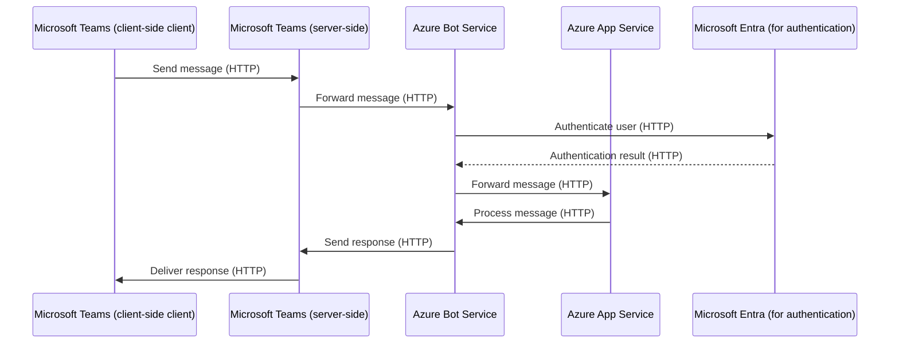

# Sequence Diagram

This sequence diagram represents a typical user scenario of using the app with the specified entities.

## Endpoints

- Microsoft Teams (client-side client): N/A
- Microsoft Teams (server-side): N/A
- Azure Bot Service: N/A
- Azure App Service: `https://<your-app-service-name>.azurewebsites.net/api/messages`
- Microsoft Entra (for authentication): N/A
