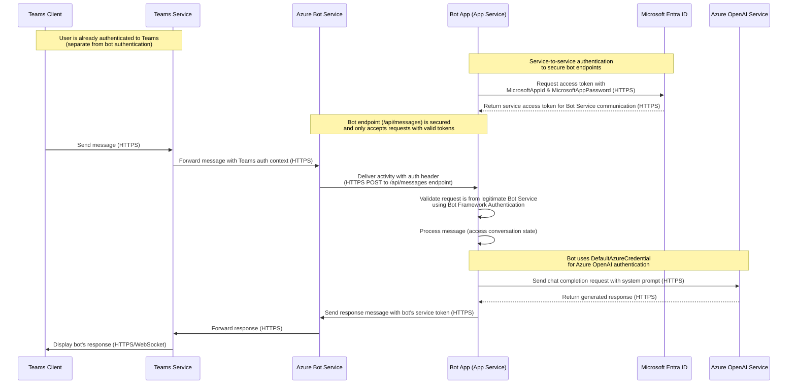

# Sequence Diagram

This sequence diagram represents a typical user scenario of using the app with the specified entities.

## Communication Protocols

- **HTTPS**: Used for all secure API communication between services
- **WebSocket**: Used for real-time communication between Teams client and service for message delivery
- **JWT (JSON Web Tokens)**: Used for authentication between services (carried over HTTPS)

## Authentication Notes

- **Teams Authentication**: The user authenticates to Teams independently before any bot interaction occurs
- **Bot Service Authentication**: The bot endpoint is secured using the app registration (MicrosoftAppId & MicrosoftAppPassword)
- **No User Resource Authentication**: This bot implementation does not include functionality for the bot to access resources on behalf of the user (no OAuthCard, token exchange, etc.)
- **Azure OpenAI Authentication**: The bot uses DefaultAzureCredential (managed identity) to authenticate with Azure OpenAI Service

## Endpoints

- Teams Client: N/A
- Teams Service: N/A
- Azure Bot Service: N/A
- Bot App (App Service): `https://<your-app-service-name>.azurewebsites.net/api/messages` (secured endpoint)
- Microsoft Entra ID: `https://login.microsoftonline.com/<tenant-id>`
- Azure OpenAI Service: `https://<your-openai-resource-name>.openai.azure.com/`
